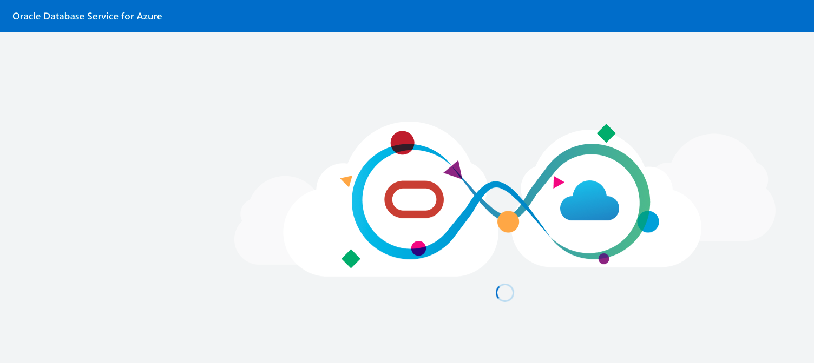
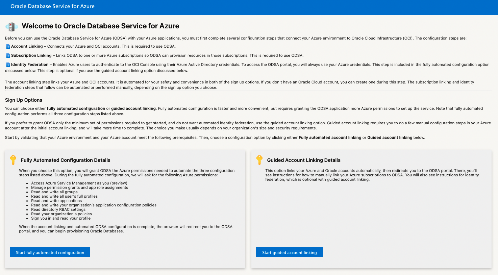
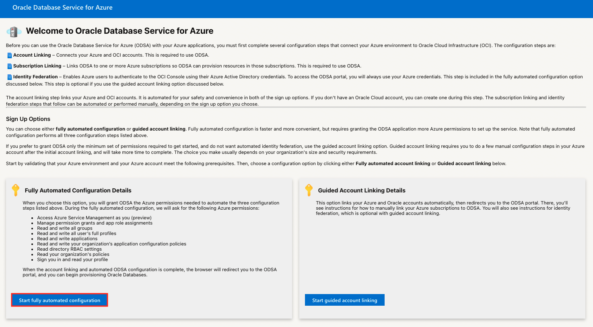
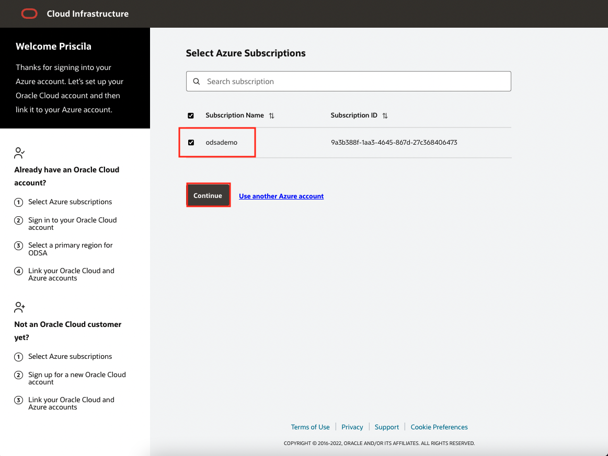
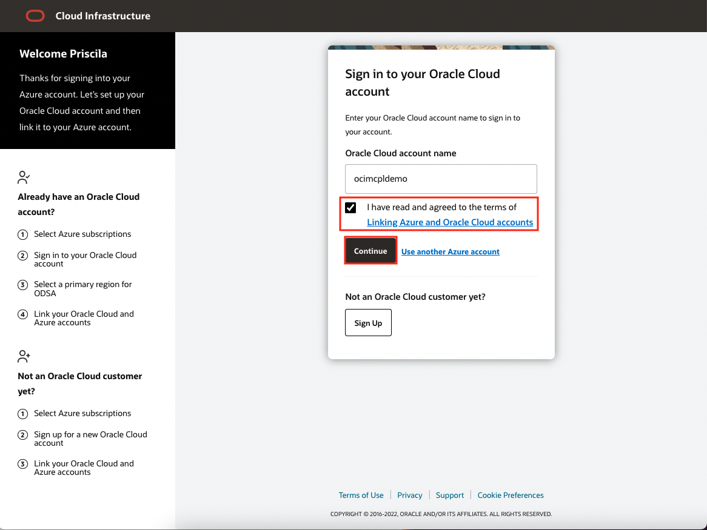

# Account Set Up

## Introduction

In this lab we will access to the Microsoft Azure Portal and sync Microsoft Azure account with Oracle Cloud Infrastructure that we will use to run the rest of the workshop. 

- [Oracle Content](https://www.oracle.com/ie/cloud/azure/oracle-database-for-azure/)
- [Microsoft Content](https://news.microsoft.com/2022/07/20/oracle-and-microsoft-announce-availability-of-oracle-database-service-for-microsoft-azure/)

**Estimated Lab Time: 15 minutes.**

### Objectives

In this lab, you will:

- Access to Microsoft Azure Portal
- Sync the Microsoft Azure account with Oracle Cloud Infrastructure

### Prerequisites

* [A Microsoft Free Account](https://azure.microsoft.com/en-us/free/)
* [An Oracle Free Tier](https://bit.ly/free-tier-1207)

## Task 1: Access to Microsoft Azure Portal and Sync Azure with OCI

1. Login to Azure ODSA Portal: [signup.multicloud.oracle.com/azure](https://signup.multicloud.oracle.com/azure)

    

2. You will be redicted to the Set Up screen:
    
    

    From this page, you choose which deployment path you want to take, automated configuration or guided account linking. 
    
    - Fully-automated configuration: This option links the Azure subscriptions that you specify to ODSA, and configures ODSA users and permissions for you. Identity federation for your OCI account is created for you, with Azure Active Directory as the identity provider. If you do not have an existing OCI account, a new account is created for you during the sign up. If you do have an OCI account, it is linked to your Azure account during the sign up.

    The fully-automated configuration option simplifies account linking and ODSA configuration, and takes just a few minutes to complete. Because the automation is configuring networking, security and user role assignments, and identity federation on your behalf, this option requires that you grant more permissions to Oracle's account linking program than the guided account linking option. You will be able to see the permissions required by Oracle to complete fully-automated configuration, and you must approve granting these permissions to Oracle before the account linking configuration takes place.

    Just as with the guided account linking option described below, you specify which Azure subscriptions will have access to Oracle Database Service for Azure.

    See [Fully-Automated Configuration](https://docs.oracle.com/en-us/iaas/Content/multicloud/signup_automated.htm#signup_automated) for instructions.
    
    - Guided account linking: This option is partially-automated, and allows you to configure user roles and permissions yourself. The process starts on an Oracle sign up page, where you either create an new OCI tenancy, or you link an existing OCI tenancy to your Azure account.

    The guided account linking option requires that you grant the minimum number of permissions to Oracle's account linking software to complete your ODSA deployment. Guided account linking will take longer, as you must do the user role and user group administration, and other ODSA configuration in your Azure account. Creating user federation for your OCI account with Azure Active Directory (AAD) as the identity provider is optional, and must be performed manually. Federating OCI IAM with AAD allows you to log into the regular OCI Console using your Azure credentials. Federation is not required to access the ODSA portal with your Azure credentials.

    If you do not have an existing OCI account, a new account is created for you during the sign up. If you do have an OCI account, it is linked to your Azure account during the sign up. 
    
    See [Guided Account Linking](https://docs.oracle.com/en-us/iaas/Content/multicloud/signup_partially_automated.htm#signup_partially_automated) for instructions.

3. We will use **Fully-Automated Configuration** option.
    
    

4. Select your **Azure Tenant Name** from the list. This tenant will be sync with the OCI tenant.click Continue.

    

5. Agreed to have read the terms of Linking Azure and Oracle Cloud accounts by Acept them and click continue.

    

6. Your account will be sync so you can access to the ODSA Portal.

    

*You can proceed to the next lab…*

## Acknowledgements
* **Author** - Priscila Iruela, Technology Product Strategy Director
* **Contributors** - Victor Martin Alvarez, Technology Product Strategy Director
* **Last Updated By/Date** - Priscila Iruela, August 2022

## Need Help?
Please submit feedback or ask for help using our [LiveLabs Support Forum](https://community.oracle.com/tech/developers/categories/livelabsdiscussions). Please click the **Log In** button and login using your Oracle Account. Click the **Ask A Question** button to the left to start a *New Discussion* or *Ask a Question*.  Please include your workshop name and lab name.  You can also include screenshots and attach files.  Engage directly with the author of the workshop.

If you do not have an Oracle Account, click [here](https://profile.oracle.com/myprofile/account/create-account.jspx) to create one.